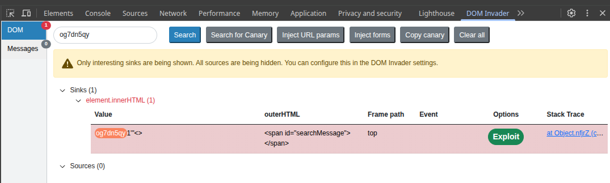

# [DOM XSS: `innerHTML` Sink Using Source `location.search`](https://portswigger.net/web-security/cross-site-scripting/dom-based/lab-innerhtml-sink)

Vulnerable code from `/?search=`:

```javascript
<script>
  function doSearchQuery(query) {
    document.getElementById('searchMessage').innerHTML = query;
  }
  var query = (new URLSearchParams(window.location.search)).get('search');
  if(query) {
    doSearchQuery(query);
  }
</script>
```



Payload: `/?search="%27>1%27"<>`