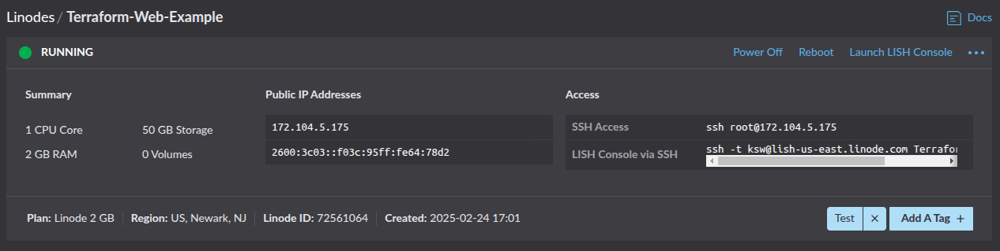

---
tags:
  - linux
---

# Using Terraform

## First Test

Creating a simple web server. Most of this is derived from the [Linode tutorial](https://www.linode.com/docs/guides/how-to-build-your-infrastructure-using-terraform-and-linode/#basic-module-structure).

```hcl
terraform {
  required_providers {
    linode = {
      source = "linode/linode"
      version = "2.34.1"
    }
  }
}

provider "linode" {
  token = "..."
}

resource "linode_instance" "terraform-web" {
        image = "linode/ubuntu18.04"
        label = "Terraform-Web-Example"
        tags = [ "Test" ]
        region = "us-east"
        type = "g6-standard-1"
        authorized_keys = [ "..." ]
        root_pass = "..."
}
```

```console
$ terraform plan

Terraform used the selected providers to generate the following execution plan. Resource actions are indicated with
the following symbols:
  + create

Terraform will perform the following actions:

  # linode_instance.terraform-web will be created
  + resource "linode_instance" "terraform-web" {
      + authorized_keys    = [
          + "...",
        ]
      + backups            = (known after apply)
      + backups_enabled    = (known after apply)
      + boot_config_label  = (known after apply)
      + booted             = (known after apply)
      + capabilities       = (known after apply)
      + disk_encryption    = (known after apply)
      + has_user_data      = (known after apply)
      + host_uuid          = (known after apply)
      + id                 = (known after apply)
      + image              = "linode/ubuntu18.04"
      + ip_address         = (known after apply)
      + ipv4               = (known after apply)
      + ipv6               = (known after apply)
      + label              = "Terraform-Web-Example"
      + lke_cluster_id     = (known after apply)
      + migration_type     = "cold"
      + private_ip_address = (known after apply)
      + region             = "us-east"
      + resize_disk        = false
      + root_pass          = (sensitive value)
      + shared_ipv4        = (known after apply)
      + specs              = (known after apply)
      + status             = (known after apply)
      + swap_size          = (known after apply)
      + tags               = [
          + "Test",
        ]
      + type               = "g6-standard-1"
      + watchdog_enabled   = true

      + alerts (known after apply)

      + config (known after apply)

      + disk (known after apply)
    }

Plan: 1 to add, 0 to change, 0 to destroy.

──────────────────────────────────────────────────────────────────────────────────────────────────────────────────────

Note: You didn't use the -out option to save this plan, so Terraform can't guarantee to take exactly these actions if
you run "terraform apply" now.
```

```console
$ terraform apply

Terraform used the selected providers to generate the following execution plan. Resource actions are indicated with
the following symbols:
  + create

Terraform will perform the following actions:

  # linode_instance.terraform-web will be created
  + resource "linode_instance" "terraform-web" {
      + authorized_keys    = [
          + "...",
        ]
      + backups            = (known after apply)
      + backups_enabled    = (known after apply)
      + boot_config_label  = (known after apply)
      + booted             = (known after apply)
      + capabilities       = (known after apply)
      + disk_encryption    = (known after apply)
      + has_user_data      = (known after apply)
      + host_uuid          = (known after apply)
      + id                 = (known after apply)
      + image              = "linode/ubuntu18.04"
      + ip_address         = (known after apply)
      + ipv4               = (known after apply)
      + ipv6               = (known after apply)
      + label              = "Terraform-Web-Example"
      + lke_cluster_id     = (known after apply)
      + migration_type     = "cold"
      + private_ip_address = (known after apply)
      + region             = "us-east"
      + resize_disk        = false
      + root_pass          = (sensitive value)
      + shared_ipv4        = (known after apply)
      + specs              = (known after apply)
      + status             = (known after apply)
      + swap_size          = (known after apply)
      + tags               = [
          + "Test",
        ]
      + type               = "g6-standard-1"
      + watchdog_enabled   = true

      + alerts (known after apply)

      + config (known after apply)

      + disk (known after apply)
    }

Plan: 1 to add, 0 to change, 0 to destroy.

Do you want to perform these actions?
  Terraform will perform the actions described above.
  Only 'yes' will be accepted to approve.

  Enter a value: yes

linode_instance.terraform-web: Creating...
linode_instance.terraform-web: Still creating... [10s elapsed]
linode_instance.terraform-web: Still creating... [20s elapsed]
linode_instance.terraform-web: Still creating... [30s elapsed]
linode_instance.terraform-web: Still creating... [40s elapsed]
linode_instance.terraform-web: Still creating... [50s elapsed]
linode_instance.terraform-web: Creation complete after 50s [id=72561064]

Apply complete! Resources: 1 added, 0 changed, 0 destroyed.
```



```console
$ terraform destroy
linode_instance.terraform-web: Refreshing state... [id=72561064]

Terraform used the selected providers to generate the following execution plan. Resource actions are indicated with
the following symbols:
  - destroy

Terraform will perform the following actions:

  # linode_instance.terraform-web will be destroyed
  - resource "linode_instance" "terraform-web" {
      - authorized_keys   = [
          - "...",
        ] -> null
      - backups           = [
          - {
              - available = false
              - enabled   = false
              - schedule  = [
                  - {
                        # (2 unchanged attributes hidden)
                    },
                ]
            },
        ] -> null
      - backups_enabled   = false -> null
      - boot_config_label = "My Ubuntu 18.04 LTS Disk Profile" -> null
      - booted            = true -> null
      - capabilities      = [
          - "SMTP Enabled",
        ] -> null
      - disk_encryption   = "disabled" -> null
      - has_user_data     = false -> null
      - host_uuid         = "438d9d778b8e24e27e8f4ac543801335f3a65dfc" -> null
      - id                = "72561064" -> null
      - image             = "linode/ubuntu18.04" -> null
      - ip_address        = "172.104.5.175" -> null
      - ipv4              = [
          - "172.104.5.175",
        ] -> null
      - ipv6              = "2600:3c03::f03c:95ff:fe64:78d2/128" -> null
      - label             = "Terraform-Web-Example" -> null
      - lke_cluster_id    = 0 -> null
      - migration_type    = "cold" -> null
      - private_ip        = false -> null
      - region            = "us-east" -> null
      - resize_disk       = false -> null
      - root_pass         = (sensitive value) -> null
      - shared_ipv4       = [] -> null
      - specs             = [
          - {
              - accelerated_devices = 0
              - disk                = 51200
              - gpus                = 0
              - memory              = 2048
              - transfer            = 2000
              - vcpus               = 1
            },
        ] -> null
      - status            = "running" -> null
      - swap_size         = 512 -> null
      - tags              = [
          - "Test",
        ] -> null
      - type              = "g6-standard-1" -> null
      - watchdog_enabled  = true -> null
        # (1 unchanged attribute hidden)

      - alerts {
          - cpu            = 90 -> null
          - io             = 10000 -> null
          - network_in     = 10 -> null
          - network_out    = 10 -> null
          - transfer_quota = 80 -> null
        }

      - config {
          - id           = 75951812 -> null
          - kernel       = "linode/grub2" -> null
          - label        = "My Ubuntu 18.04 LTS Disk Profile" -> null
          - memory_limit = 0 -> null
          - root_device  = "/dev/sda" -> null
          - run_level    = "default" -> null
          - virt_mode    = "paravirt" -> null
            # (1 unchanged attribute hidden)

          - devices {
              - sda {
                  - disk_id    = 141029448 -> null
                  - disk_label = "Ubuntu 18.04 LTS Disk" -> null
                  - volume_id  = 0 -> null
                }
              - sdb {
                  - disk_id    = 141029449 -> null
                  - disk_label = "512 MB Swap Image" -> null
                  - volume_id  = 0 -> null
                }
            }

          - helpers {
              - devtmpfs_automount = true -> null
              - distro             = true -> null
              - modules_dep        = true -> null
              - network            = true -> null
              - updatedb_disabled  = true -> null
            }
        }

      - disk {
          - authorized_keys  = [] -> null
          - authorized_users = [] -> null
          - filesystem       = "ext4" -> null
          - id               = 141029448 -> null
          - label            = "Ubuntu 18.04 LTS Disk" -> null
          - read_only        = false -> null
          - size             = 50688 -> null
          - stackscript_data = (sensitive value) -> null
          - stackscript_id   = 0 -> null
            # (2 unchanged attributes hidden)
        }
      - disk {
          - authorized_keys  = [] -> null
          - authorized_users = [] -> null
          - filesystem       = "swap" -> null
          - id               = 141029449 -> null
          - label            = "512 MB Swap Image" -> null
          - read_only        = false -> null
          - size             = 512 -> null
          - stackscript_data = (sensitive value) -> null
          - stackscript_id   = 0 -> null
            # (2 unchanged attributes hidden)
        }
    }

Plan: 0 to add, 0 to change, 1 to destroy.

Do you really want to destroy all resources?
  Terraform will destroy all your managed infrastructure, as shown above.
  There is no undo. Only 'yes' will be accepted to confirm.

  Enter a value: yes

linode_instance.terraform-web: Destroying... [id=72561064]
linode_instance.terraform-web: Still destroying... [id=72561064, 10s elapsed]
linode_instance.terraform-web: Still destroying... [id=72561064, 20s elapsed]
linode_instance.terraform-web: Destruction complete after 28s

Destroy complete! Resources: 1 destroyed.
```

## `linode-cli`

```console
$ pipx install linode-cli
  installed package linode-cli 5.56.2, installed using Python 3.12.3
  These apps are now globally available
    - lin
    - linode
    - linode-cli
done! ✨ 🌟 ✨
```

```console
$ linode-cli configure --token
Welcome to the Linode CLI.  This will walk you through some initial setup.

First, we need a Personal Access Token.  To get one, please visit
https://cloud.linode.com/profile/tokens and click
"Create a Personal Access Token".  The CLI needs access to everything
on your account to work correctly.
Personal Access Token: ...

Configuring luser

Default Region for operations.  Choices are:
  1 - ap-northeast
  2 - ap-south
  3 - ap-southeast
  4 - ap-west
  5 - au-mel
  6 - br-gru
  7 - ca-central
  8 - de-fra-2
  9 - es-mad
 10 - eu-central
 11 - eu-west
 12 - fr-par
 13 - gb-lon
 14 - id-cgk
 15 - in-bom-2
 16 - in-maa
 17 - it-mil
 18 - jp-osa
 19 - jp-tyo-3
 20 - nl-ams
 21 - se-sto
 22 - sg-sin-2
 23 - us-central
 24 - us-east
 25 - us-iad
 26 - us-lax
 27 - us-mia
 28 - us-ord
 29 - us-sea
 30 - us-southeast
 31 - us-west

Default Region (Optional): 7

Default Type of Linode to deploy.  Choices are:
  1 - g1-gpu-rtx6000-1
  2 - g1-gpu-rtx6000-2
  3 - g1-gpu-rtx6000-3
  4 - g1-gpu-rtx6000-4
  5 - g2-gpu-rtx4000a1-l
  6 - g2-gpu-rtx4000a1-m
  7 - g2-gpu-rtx4000a1-s
  8 - g2-gpu-rtx4000a1-xl
  9 - g2-gpu-rtx4000a2-hs
 10 - g2-gpu-rtx4000a2-m
 11 - g2-gpu-rtx4000a2-s
 12 - g2-gpu-rtx4000a4-m
 13 - g2-gpu-rtx4000a4-s
 14 - g6-dedicated-16
 15 - g6-dedicated-2
 16 - g6-dedicated-32
 17 - g6-dedicated-4
 18 - g6-dedicated-48
 19 - g6-dedicated-50
 20 - g6-dedicated-56
 21 - g6-dedicated-8
 22 - g6-nanode-1
 23 - g6-standard-1
 24 - g6-standard-16
 25 - g6-standard-2
 26 - g6-standard-20
 27 - g6-standard-24
 28 - g6-standard-32
 29 - g6-standard-4
 30 - g6-standard-6
 31 - g6-standard-8
 32 - g7-highmem-1
 33 - g7-highmem-16
 34 - g7-highmem-2
 35 - g7-highmem-4
 36 - g7-highmem-8
 37 - g7-premium-16
 38 - g7-premium-2
 39 - g7-premium-32
 40 - g7-premium-4
 41 - g7-premium-48
 42 - g7-premium-50
 43 - g7-premium-56
 44 - g7-premium-8

Default Type of Linode (Optional): 22

Default Image to deploy to new Linodes.  Choices are:
  1 - linode/almalinux8
  2 - linode/almalinux9
  3 - linode/alpine3.17
  4 - linode/alpine3.18
  5 - linode/alpine3.19
  6 - linode/alpine3.20
  7 - linode/arch
  8 - linode/centos-stream9
  9 - linode/debian11
 10 - linode/debian12
 11 - linode/debian12-kube-v1.29.7
 12 - linode/debian12-kube-v1.30.3
 13 - linode/debian12-kube-v1.31.0
 14 - linode/debian12-kube-v1.32.1
 15 - linode/fedora39
 16 - linode/fedora40
 17 - linode/fedora41
 18 - linode/gentoo
 19 - linode/kali
 20 - linode/opensuse15.5
 21 - linode/opensuse15.6
 22 - linode/rocky8
 23 - linode/rocky9
 24 - linode/slackware15.0
 25 - linode/ubuntu16.04lts
 26 - linode/ubuntu18.04
 27 - linode/ubuntu20.04
 28 - linode/ubuntu22.04
 29 - linode/ubuntu24.04
 30 - linode/ubuntu24.10

Default Image (Optional): 10

Select the user that should be given default SSH access to new Linodes.  Choices are:
 1 - luser

Default Option (Optional): 1

Configure a custom API target? [y/N]:

Suppress API Version Warnings? [y/N]:
Active user is now luser
```

**Custom Images:** You can also deploy instances from your own custom images (e.g. ones you built or snapshot). Custom images are identified by an ID prefixed with `private/`. For instance, a private image might have an ID like `private/123456`​. To use a custom image in Terraform, set the `image` to that ID. For example, if you have a custom image with ID 17691867, you’d use `image = "private/17691867"` in your config​. (All custom image IDs begin with "private/"; in this example `private/17691867` is the ID output from a Packer-built image​.) You can retrieve your custom image IDs via the Linode Cloud Manager or API (the Linode API’s image list will include your private images when called with your API token​.

If you need to manage custom images as resources, Terraform’s Linode provider also offers a **`linode_image`** resource and data source, which let you create or look up images (e.g. create an image from a Linode disk, or fetch an image’s details)​. But in most cases, deploying a custom image simply involves referencing its `private/<id>` in the `linode_instance` resource.